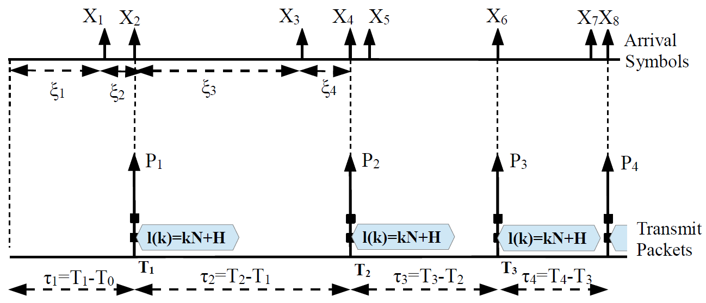
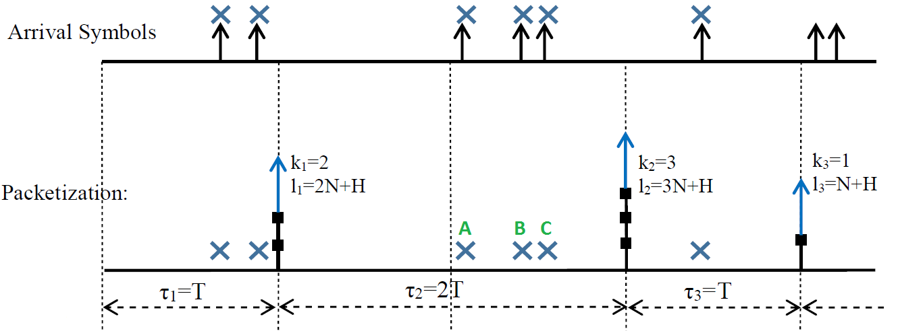

# CRN-Queueing
CRN-queueing package is a tool for simulating the behaviour of packets in cognitive radio network or cognitive radio sensor networks. The aim of this package is calculating different features of such a system in addition to many other objectives which can be add to its framework. 

 The package includes four main cores.
 1- symbol generator
 1- packetizer
 1-channel generator
 1- paket transmission simulator
 In order to understand how each of these cores participate in the simulation a sample (sample.m) is provided which utilize all of these cores to simulate a CRN with single pair of users.
 Following is the description of sample exmaple
 #Sample model
The code starts with following code. These lines are used to define some flags to make sure that the parameters that we are going to ask from a user completely gathered.
```
framing_flag = 0;
TK_flag =0;
Ber_flag =0;
Rch_flag =0;
lambda_flag=0;
input_flag = 0;
```

Following section is for getting data from users.  Users are being asked to provide values for the simulation for example type of framing type of input process....

```matlab
display('starting CRN channel queue simulation...');
display('Please answer following question in order to initialize simulation parameters')
%try
if (user_input == 1)
    while input_flag ==0
        display('What typr of input process you want to choose for this simulation? Please insert 1 for Poisson or 2 for Deterministic');
        x = input('','s');
        if (x=='1' || x=='2')
            input_flag=1;
        end
        if (x=='1')
            display('Poisson is choosen');
            sim.input_process = 1;
        end
        if (x=='2')
            display('Deterministic is choosen');
            sim.input_process = 2;
        end
    end
    while lambda_flag ==0
        
        
        display('What is the lambda for the input generation?');
        y = input('');
        if(isnumeric(y))
            sim.lambda =y;
            lambda_flag =1;
        end
    end
```

```matlab    
    while framing_flag ==0
        display('What kind of Framing mode you want to choose for this simulation? Please insert 1 for Time based or 2 for Number based');
        x = input('','s');
        if (x=='1' || x=='2')
            framing_flag=1;
        end
        if (x=='1')
            display('Time based method is choosen');
            sim.Framing_mode = 1;
        end
        if (x=='2')
            display('Number based method is choosen');
            sim.Framing_mode = 2;
        end
    end
    
    while TK_flag ==0
        
        if (x=='1')
            display('In how many seconds you want to packetize your symbols?');
            y = input('');
            if(isnumeric(y))
                TK_flag =1;
                T = y;
            end
        end
        if (x=='2')
            display('Please specify number of symbols in each packet?');
            y = input('');
            if(isnumeric(y))
                TK_flag =1;
                K = y;
            end
        end
    end
```
In this section of the example framing mode is selected b a user. There two different type of framing defined in the current version of the ""Number based and Time based.
#Number Based

#Time Based 

```matlab 
    while Rch_flag ==0
        
        
        display('What is the rate of channel?');
        y = input('');
        if(isnumeric(y))
            sim.ch.Rch =y;
            Rch_flag =1;
        end
    end
    while Ber_flag ==0
        
        
        display('What is the channel bit error rate?');
        y = input('');
        if(isnumeric(y))
            sim.ch.BER=y;
            Ber_flag =1;
        end
    end
end
```
Following block contains all of the default setting for the imulation

```
sim = init_sim(2);
sim.input_process = 1;
sim.lambda =100;
sim.Framing_mode = 2;
K=10;
sim.ch.Rch =500;
sim.ch.BER=1e-4;
user_input = 0;
sim.control.debug_active = 0;
sim.u =2;
sim.v =2;
```
The actual simulation start from this section
```matlab
sim = calc_sim_params(sim);
%Setting up H,N,lambda,a=1/lambda,Kv
H = sim.H;  N = sim.N; lambda = sim.lambda;  a=1/lambda; Kv=sim.Kv;
if (sim.input_process == 1)              %Poisson process with rate 1/a,
    int_arrivals = random('exp', a,[1,sim.run.Nsym;]);   %generate interarrival times
elseif (sim.input_process == 2)          %Deterministic inputs
    int_arrivals = a * ones (SU,nsyms);           %interarrival times are constant
end
t=clock;
fprintf('\n\n***********************************************************************************\n');
fprintf(' Date:%d-%d-%d   Time: %d:%d \n', floor(t(1:5)));
fprintf('***********************************************************************************\n');
if sim.Framing_mode==1
    [tp, kp, fiv] = f_perform_framing(sim.Framing_mode, int_arrivals, T, sim.control.debug_active);
else
    [tp, kp, fiv] = f_perform_framing(sim.Framing_mode, int_arrivals, K, sim.control.debug_active);
end
queue.tp=tp; queue.kp=kp;
[queue] = f_q_evolution(queue, sim, 1);
te=clock;
delay = mean(queue.wnv + queue.sv);
  if sim.cognitive, fprintf('COGNITIVE Results ServiceTime[%f]   WaitingTime[%f]  Delay[%f] \n', ...
                mean(queue.sv),mean(queue.wnv), delay);    end

catch
 display('!!!!!!!!!!!!It seems you did not follow the requested format for the input please try agian!!!!!!!!!!!!')
end

```
